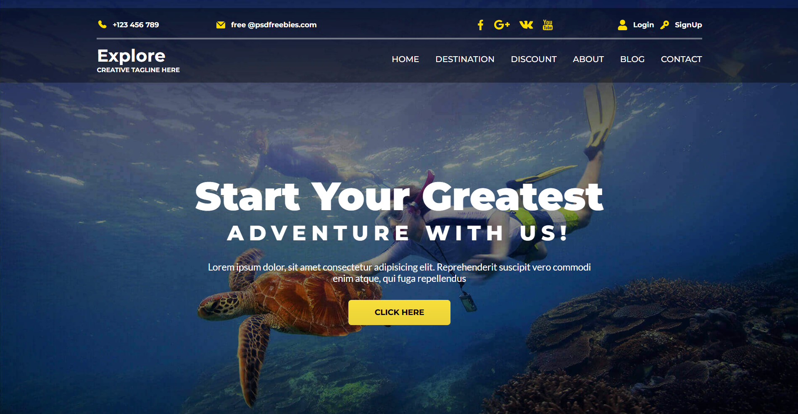

# Travel Agency Website

A modern, responsive travel agency website built with React and Vite.



## Overview

This Travel Agency website is a feature-rich platform designed to help travelers find and book their perfect vacation. Built with React and Vite, it offers a seamless user experience with interactive components for hotel search, service discovery, location browsing, and customer reviews.

## Features

-   **Interactive UI**: Modern and responsive design across all devices
-   **Hotel Search**: Find accommodations based on location, dates, and budget
-   **Travel Services**: Showcase of various travel services and packages
-   **Destination Exploration**: Browse popular and trending travel destinations
-   **Customer Reviews**: Testimonials from satisfied travelers
-   **Budget-Friendly Options**: Filter travel options based on different budget ranges
-   **Social Media Integration**: Connect with the agency's social media presence
-   **Contact Form**: Easy communication with the agency for inquiries and bookings

## Tech Stack

-   **React**: Frontend UI library
-   **Vite**: Next generation frontend tooling
-   **CSS3**: Custom styling with dedicated CSS files for each component
-   **JSX**: Component-based architecture for reusable UI elements
-   **React Router**: For seamless navigation between sections

## Project Structure

```
travel-agency/
├── public/                # Static assets
│   ├── logo.svg
│   └── vite.svg
├── src/
│   ├── assets/            # Images and icons organized by section
│   │   ├── backgrounds/
│   │   ├── budgetIcons/
│   │   ├── contactIcons/
│   │   ├── headerIcons/
│   │   ├── reviewIcons/
│   │   ├── servicesIcons/
│   │   └── socialMediaIcons/
│   ├── cards/            # Card components for different content types
│   │   ├── bestServices.jsx
│   │   ├── locations.jsx
│   │   ├── looks.jsx
│   │   └── serviceItems.jsx
│   ├── components/       # Major reusable UI components
│   │   ├── BestServices.jsx
│   │   ├── Footer.jsx
│   │   ├── Header.jsx
│   │   ├── Locations.jsx
│   │   ├── Looks.jsx
│   │   └── Services.jsx
│   ├── css/              # Styling for each section
│   │   ├── FindHotels.css
│   │   ├── Footer.css
│   │   ├── Header.css
│   │   ├── Location.css
│   │   ├── Reviews.css
│   │   ├── Services.css
│   │   ├── Sponsored.css
│   │   └── TravelSince.css
│   ├── sections/         # Main page sections
│   │   ├── FindHotels.jsx
│   │   ├── Locations.jsx
│   │   ├── Reviews.jsx
│   │   ├── Services.jsx
│   │   ├── Sponsored.jsx
│   │   └── TravelSince.jsx
│   ├── App.jsx           # Main application component
│   ├── index.jsx         # Header component
│   └── main.jsx          # Entry point
└── vite.config.js        # Vite configuration
```

## Getting Started

### Prerequisites

-   Node.js (v14.0.0 or later)
-   npm or yarn

### Installation

1. Clone the repository

    ```
    git clone https://github.com/yourusername/travel-agency.git
    ```

2. Install dependencies

    ```
    cd travel-agency
    npm install
    ```

3. Start the development server

    ```
    npm run dev
    ```

4. Open your browser to `http://localhost:5173`

## Build for Production

```
npm run build
```

The build artifacts will be stored in the `dist/` directory.

## Design Philosophy

The Travel Agency website is designed with the following principles in mind:

-   **User Experience First**: Easy navigation and intuitive interfaces
-   **Visual Appeal**: Stunning imagery to inspire travel enthusiasm
-   **Responsive Design**: Optimal viewing on any device size
-   **Performance**: Fast loading times and smooth interactions
-   **Accessibility**: Inclusive design for all users

## Key Sections

1. **Header/Home**: Introduction to the agency with primary navigation
2. **Find Hotels**: Interactive search for accommodations
3. **Services**: Highlight of various travel services offered
4. **Travel Since**: Company history and expertise
5. **Locations**: Featured destinations with imagery
6. **Sponsored**: Partner showcases and deals
7. **Reviews**: Customer testimonials and ratings
8. **Footer**: Contact information and additional links

## Future Enhancements

-   User authentication and profiles
-   Online booking and payment processing
-   Interactive maps for destination exploration
-   Travel blog and tips section
-   Real-time chat support
-   Multilingual support

## Contributing

Contributions are welcome! Please feel free to submit a Pull Request.

## License

This project is licensed under the MIT License.

## Acknowledgments

-   All images used are for demonstration purposes
-   Inspired by modern travel agency websites
-   Special thanks to all contributors who helped create this project
